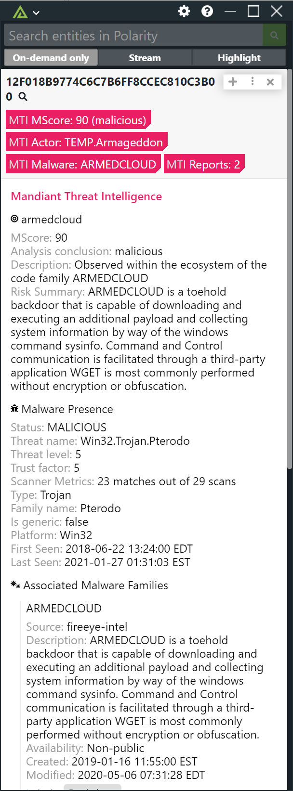
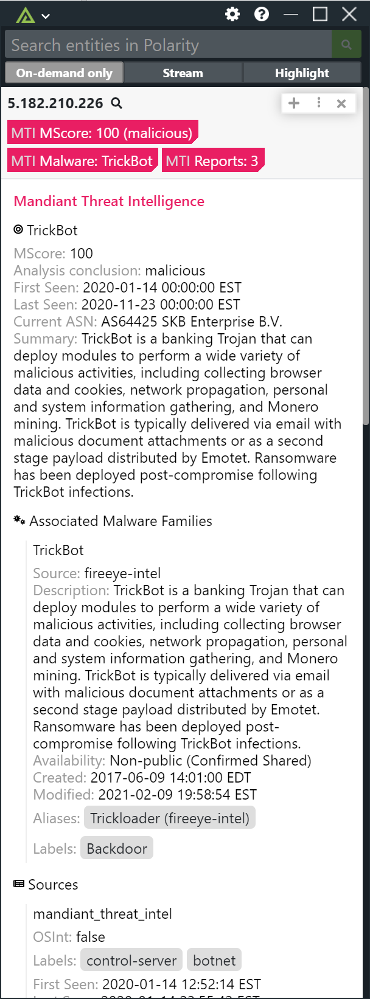
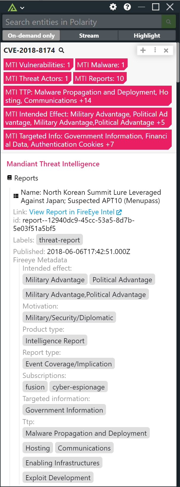

# Polarity Mandiant Threat Intelligence Integration

Provides automated access to indicators of compromise (IOCs), CVE information, as well as information on the adversary from the Mandiant Threat Intelligence API.

## About Mandiant Threat Intelligence

The Mandiant Threat Intelligence API provides machine-to-machine-integration with the most contextually rich threat intelligence data available on the market today. The API provides automated access to indicators of compromise (IOCs)—IP addresses, domain names, URLs used by threat actors—as well as information on the adversary, to further enrich integrations. The API supports Python, Java, PHP, C++, and C# programming languages.

For more information please see www.FireEye.com/intel

|  |  |  |
|---|--|--|
|*Hash Result* | *IP Result* | *CVE Result*|

## Mandiant Threat Intelligence Integration Options

### Mandiant V3 URL
The URL for the Mandiant Threat Intelligence V3 API.  Defaults to `https://api.intelligence.fireeye.com`. Leave empty if your keys are not compatible with this API version.

### Mandiant V4 URL
The URL for the Mandiant Threat Intelligence V4 API.  Defaults to `https://api.intelligence.mandiant.com`. Leave empty if your keys are not compatible with this API version.

### Public Key
Your Mandiant Threat Intelligence API public key

### Private Key
Your Mandiant Threat Intelligence API private key.

### Minimum MScore to Display
The minimum MScore (0-100) required for indicators to be displayed [default is 80].  Indicators with a MScore above 80 are considered malicious.

### Ignored Entities
Comma separated list of entities that you never want looked up. Should be set to "Only admins can view and edit".

### Ignored Domains Regex
Domains that match the given regex will not be looked up (if blank, no domains will be black listed).  Should be set to "Only admins can view and edit".

### Max Concurrent Requests
Maximum number of concurrent requests.  Integration must be restarted after changing this option. Defaults to 20.

### Minimum Time Between Lookups
Minimum amount of time in milliseconds between lookups. Integration must be restarted after changing this option. Defaults to 100.

## Polarity

Polarity is a memory-augmentation platform that improves and accelerates analyst decision-making.  For more information about the Polarity platform please see:

https://polarity.io/
