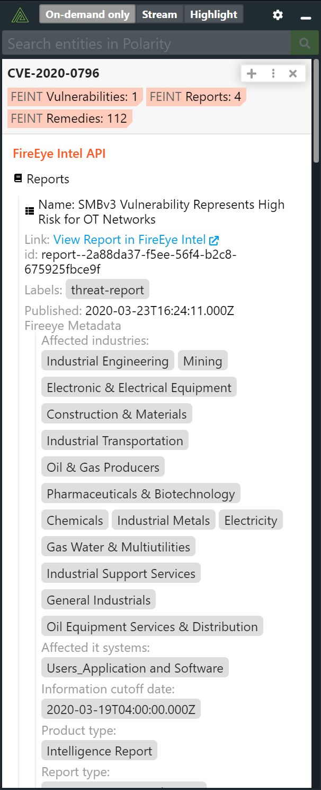

# Polarity FireEye Intel API Integration

Returns information about entities that are associated with Malware, a Threat Actor, or Vulnerability.  The integration can also be configured to return entities that are tracked as indicators within the FireEye Intel API platform.

> Due to the way collection searches work, when Indicator searching is enabled, the integration requires two lookups per entity.

## FireEye Intel API Options

### FireEye Intel API REST URL

The URL for the FireEye Intel API. Defaults to `https://api.intelligence.fireeye.com`.

### Intel API Public Key

Your FireEye Intel API public key

### Intel API Private Key

Your FireEye Intel API private key.

### Enable Indicator Search

If checked, the integration will return Indicator results from the FireEye Intel API. Enabling this option requires the integration to issue an extra REST API lookup request per entity.  When disabled, the integration will only return results if an entity is associated with Malware, a Threat Actor or Vulnerability.

### Blocklisted Entities

Comma separated list of entities that you never want looked up. Should be set to "Only admins can view and edit".

### Domain Blocklist Regex

Domains that match the given regex will not be looked up (if blank, no domains will be black listed). Should be set to "Only admins can view and edit".

## Polarity

Polarity is a memory-augmentation platform that improves and accelerates analyst decision-making.  For more information about the Polarity platform please see:

https://polarity.io/
